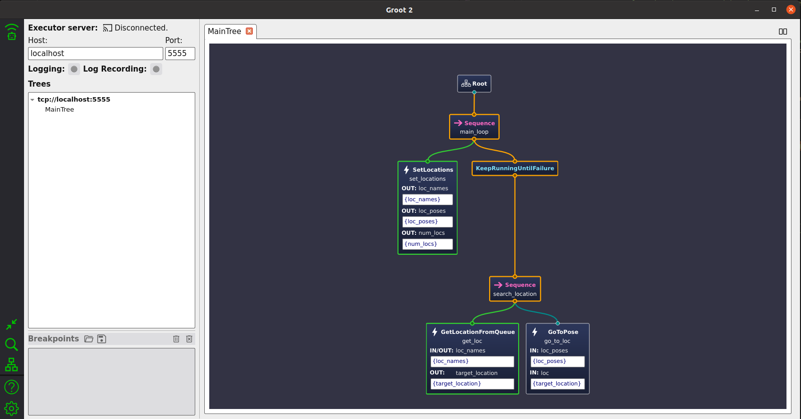

# Behavior Tree Setup

## Build Behavior Tree BT_NAV2 PKG

- cd ~/ros2_ws/src
- git clone -b bt_nav2 https://github.com/AuTURBO/bt_template.git
- cd ~/ros2_ws
- colcon build

## Run Behavior Tree BT_NAV2 PKG

### Groot2 Launch

- ~/Groot2/bin/groot2

### Behavior Tree BT_NAV2 PKG RUN

`TERMINAL 1 : TURTLEBOT3 WORLD 및 NAV2이 갖춰진 환경에서 실시`

- source ~/ros2_ws/install/local_setup.bash
- ros2 launch turtlebot3_gazebo turtlebot3_world.launch.py
- ros2 launch turtlebot3_navigation2 navigation2.launch.py

`TERMINAL 2 : BT로 Waypoint 주행`

- source ~/ros2_ws/install/local_setup.bash
- ros2 run bt_nav2 bt_main

`[선택] TERMINAL 3 : Nav2 Goal까지 남은거리 Feedback`

- source ~/ros2_ws/install/local_setup.bash
- ros2 run bt_nav2 bt_main
