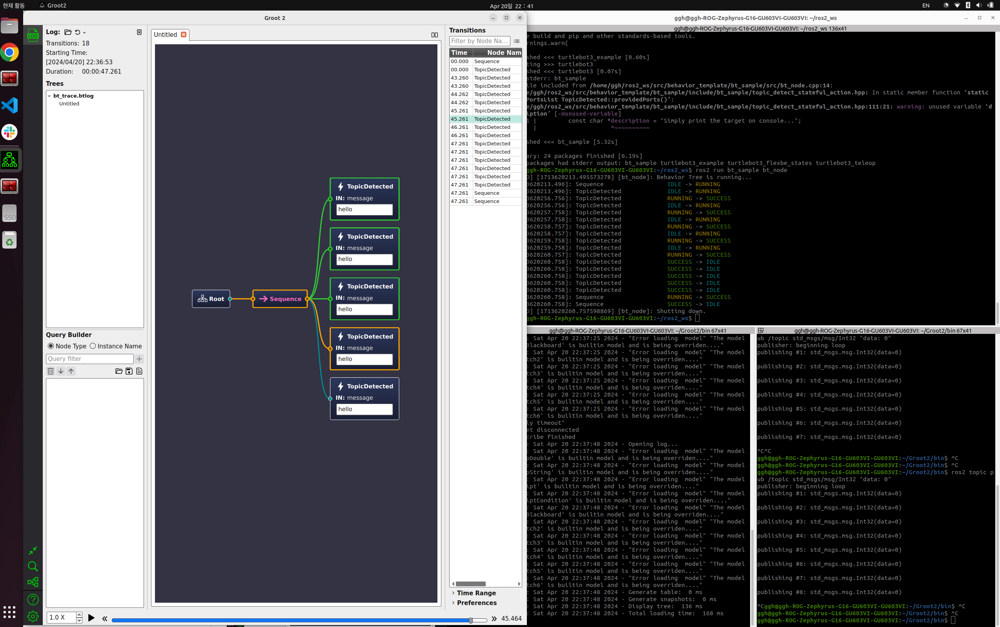

# BT_Sample PKG


## Behavior Tree Setting

---

### Groot 2 Install

---

> `.run` 파일을 설치 후 권한을 부여 후 실행
> 

[](https://s3.us-west-1.amazonaws.com/download.behaviortree.dev/groot2_linux_installer/Groot2-v1.5.2-linux-installer.run)

```bash
cd ~/Downloads
sudo chmod 777 Groot2-v1.5.2-linux-installer.run 
./Groot2-v1.5.2-linux-installer.run
```

### Groot 2 Launch

---

```bash
cd ~/Groot2/bin ; ./groot2
```

> 다음 명령어를 통해 groot 로 단축키를 만들어 사용할 수 있습니다.
> 

```bash
echo "alias groot='cd ~/Groot2/bin ; ./groot2'" >> ~/.bashrc
```

### Behavior Tree Install & Build ( Version 4.5 )

---

> Behavior Tree Install
> 

```bash
cd ~/ros2_ws/src
git clone https://github.com/BehaviorTree/BehaviorTree.CPP
```

> Behavior Tree build
> 

```bash
sudo apt install libzmq3-dev libboost-dev qtbase5-dev libqt5svg5-dev libzmq3-dev libdw-dev
cd ~/ros2_ws/src/BehaviorTree.CPP
mkdir build; cd build
cmake ..
make -j8
sudo make install
```

> 경로 지정
> 

```bash
echo "export LD_LIBRARY_PATH=/usr/local/lib:$LD_LIBRARY_PATH" >> ~/.bashrc
```

### Install Behavior Tree Sample PKG

```bash
cd ~/ros2_ws/src
git clone https://github.com/AuTURBO/bt_tamplate.git
cd ~/ros2_ws 
colcon build
```

## BehaviorTree Sample PKG Launch

---

### Groot2 Launch

```bash
groot2
```

### Behavior Tree Sample PKG Launch

```bash
ros2 run bt_sample bt_node
```